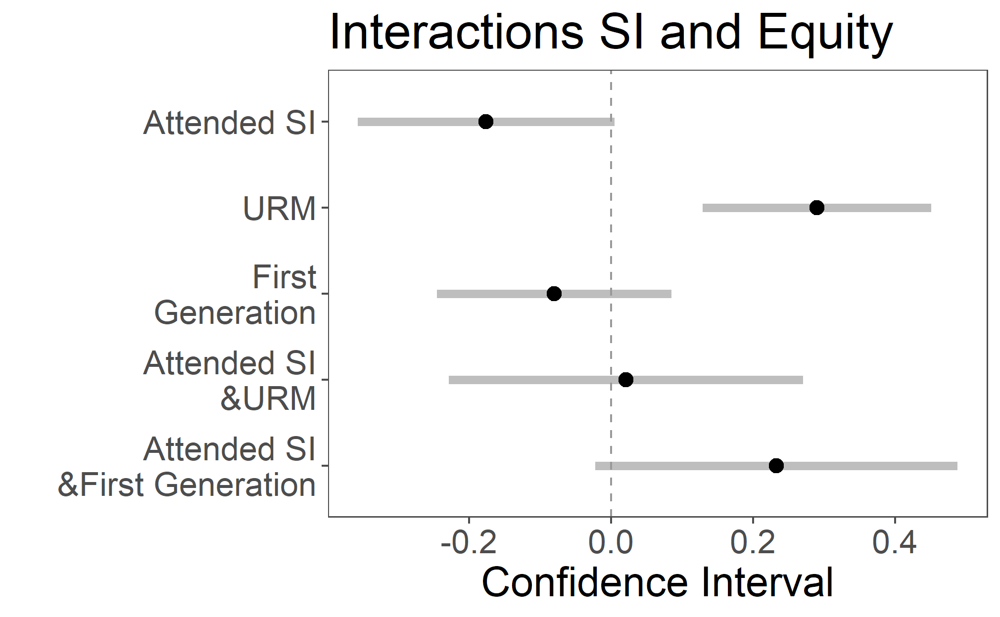

```{r setup, include=FALSE}
# Notes: Manually change right logo to width = 95% in .html file
knitr::opts_chunk$set(echo = FALSE)
library(knitr)
library(tidyverse)
library(Hmisc) # Enables %nin% notation for "not in"
library(readxl) # read Excel file
library(magrittr) #Allows %<>% notation to update lhs object with resulting value
library(naniar)
library(tinytex)
library(ggplot2)
library(stargazer)

course.level <- read_csv("data/course_analysis_dataset.csv")
course.level$Term.Year<-factor(course.level$Term.Year)
course.level$SI.Component.Flag<-factor(course.level$SI.Component.Flag)
No.SI <- filter(course.level, SI.Component.Flag == "0")
```

## Original Source Data (via CSU Chico Instituional Research)
* Course Detail.csv
  - n = 43,803
  - Row contains record for course sections from Fall 2012 to Winter 2022
* Student Profile Metric.csv
  - n = 49,107
  - Row contains one record per student matriculation for students enrolled from Fall 2012 to Spring 2022
* Student Program.csv
  - n = 343,781
  - Row contains records for each semester of each student's attendance who were enrolled from Fall 2012 to Winter 2022
  
## Original Source Datasets (acquired via CSU Cico Instituional Research)
* SLC Appointment.csv
  - n = 78,229
  - Row contains record for each day that a student went to an SI session, and how many they went to in that day (Fall 2015 - Spring 2022)
* Student Grade.xlsx
  - n = 864,471
  - Row contains final grade data earned for each course for each student from Fall 2016 to Winter 2022
  
## Data Preparation
### Student Level Analysis (n = 19,565)
* Only student records dated 2016 or later
* Only first-time freshmen
* Best attempt at isolating most recent student program record
* Approximately 35% of students in the programs dataset are not present in the profiles dataset. Therefore, these records have missing data for HS/Transfer GPA, one-year retention, and matriculation/graduation terms
* Records with missing data for the following attributes were dropped:
  - High School GPA
  - Attended Orientation Flag
  - STEM Major Flag
  - Full Time / Part Time Code
  - Academic Program

## Data Preparation
### Course Level Analysis (n = 5,637)
* Includes class size, average high school GPA, % first-gen in the class, % URM in the class, DWF rate, SI component flag, term year
  - These were calculated using the grades data provided by IR
  - Students with missing records for high school GPA were not included in the calculation
  - Students with missing records for URM and first-gen status were considered as not a member of these groups
* Course records from 2016-2019
* Course sections with less than 10 records of an SI visit during the semester were considered as sections without an SI-component
* Courses represented have a number less than 300 and are not a special number (x89, x99, etc.)
* To remove high calculated DWF outliers, class size >= 20

## Data Preparation
### Coarsened Exact Matching Analysis (n = 19,565)
* Student profiles, programs, and grades with course level information for courses with SI
* Only student records dated 2016 to 2019 who DID NOT DROP
* Best attempt at isolating most recent student program record
* Approximately 35% of students in the programs dataset are not present in the profiles dataset. Therefore, these records have missing data for HS/Transfer GPA, one-year retention, and matriculation/graduation terms
* Records with missing data for the following attributes were dropped:
  - High School GPA
  - Attended Orientation Flag
  - STEM Major Flag
  - Full Time / Part Time Code
  - Academic Program
  
## Course Level Details

- Variables: avg HS GPA, First Gen, URM, class size, DWF rate, class average, SI component, term year
- Courses from term years 2016-2019
- URM and First Generation percentages
- Lower Division courses
- Courses with class size 20+

## URM and DWF Rate

```{r cars, echo = TRUE}
ggplot(course.level, aes(URM, dwf.rate, color = URM)) + geom_point() + facet_wrap(. ~Term.Year) + xlab("Percent URM") + ylab("DWF Rate") + geom_point(data=No.SI, aes(x=URM, y=dwf.rate), color = 'red') + theme(legend.position="none") + geom_smooth(se=F) 
```

## First Generation and DWF Rate

```{r pressure}
ggplot(course.level, aes(First.Gen.Perc, dwf.rate, color = First.Gen.Perc)) + geom_point() + facet_wrap(. ~Term.Year) + xlab("Percent First Gen") + ylab("DWF Rate")+ geom_point(data=No.SI, aes(x=URM, y=dwf.rate), color = 'red') + theme(legend.position="none") + geom_smooth(se=F)
```

## Course Level Modelling

```{r, results = 'asis', echo = FALSE}
stargazer(m, m2, off.ratio=T, single.row = TRUE, type = "latex", title = "Results Multilinear Regression")
```

# Student Level Analysis 

- Measuring student level equity gaps
  - Students who under represented minorities 
  - Students who are first generation
- Measuring success
  - One-year retention
  
# Student Level Analysis 

```{r fig1, out.width="90%", echo=FALSE,fig.show='hold',fig.align='center'}
knitr::include_graphics("pictures/fig1.png")
```

# Student Level Analysis 

```{r fig2, out.width="90%", echo=FALSE,fig.show='hold',fig.align='center'}
knitr::include_graphics("pictures/fig2.png")
```
  
# Student Level Analysis: Modeling 

- Logistic regression 
- Explanatory variables:
  - Student characteristics: URM, First Generation, Gender, Stem Major, number of units taken in the semester, number of units passed in the semester, Cohort term year, SI attendance 
  - Course characteristics: Academic level, Course fee existence, GE class 
  
```{r eval=FALSE, include=FALSE}
# one model without interactions 
# one with inter 
```

  
# Student Results

```{r fig3, out.width="90%", echo=FALSE,fig.show='hold',fig.align='center'}

```

# Student Results: Interactions 

```{r fig4, out.width="90%", echo=FALSE,fig.show='hold',fig.align='center'}

```

## Causal Inference 

- {#id .class width=50% height=50%}
- We want to measure the impact SI has on student performance.
- We need to control for these confounding variables!
- We can accomplish this by matching students with similar characteristics.

## How do we match?

- We can't match exactly!
- We coarsen our covariates (think binning). 
- We can now match exactly on our coarsened data.
- Lastly, throw out any unmatched observations

## Controlling for Confounding with Coarsened Exact Matching


  

  


