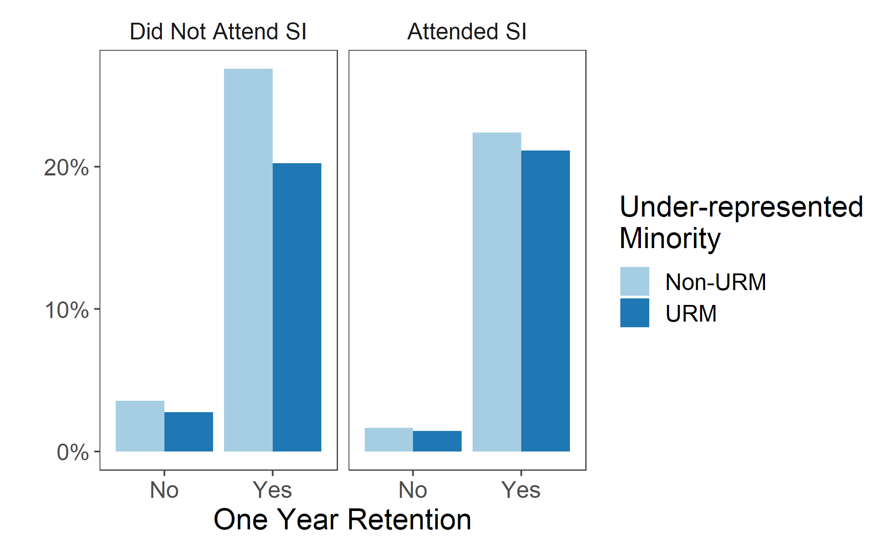
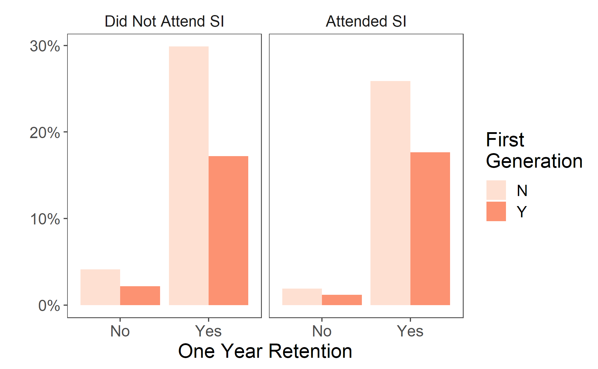

```{r setup, include=FALSE}
# Notes: Manually change right logo to width = 95% in .html file
knitr::opts_chunk$set(echo = FALSE)
library(knitr)
```

# Student Level Analysis 

- Measuring student level equity gaps
  - Students who under represented minorities 
  - Students who are first generation
- Measuring success
  - One-year retention
  
# Student Level Analysis 

```{r fig1, out.width="90%", echo=FALSE,fig.show='hold',fig.align='center'}

```

# Student Level Analysis 

```{r fig2, out.width="90%", echo=FALSE,fig.show='hold',fig.align='center'}

```
  
# Student Level Analysis: Modeling 

- Logistic regression 
- Explanatory variables:
  - Student characteristics: URM, First Generation, Gender, Stem Major, number of units taken in the semester, number of units passed in the semester, Cohort term year, SI attendance 
  - Course characteristics: Academic level, Course fee existence, GE class 
- Primary variables of interest: SI and the interaction between SI the measures of equity 
  
```{r eval=FALSE, include=FALSE}
# one model without interactions 
# one with inter 
```

  
# Student Results

```{r fig3, out.width="90%", echo=FALSE,fig.show='hold',fig.align='center'}
knitr::include_graphics("pictures/fig5.png")
```

# Student Results: Interactions 

```{r fig4, out.width="90%", echo=FALSE,fig.show='hold',fig.align='center'}
knitr::include_graphics("pictures/fig6.png")
```


  

  


