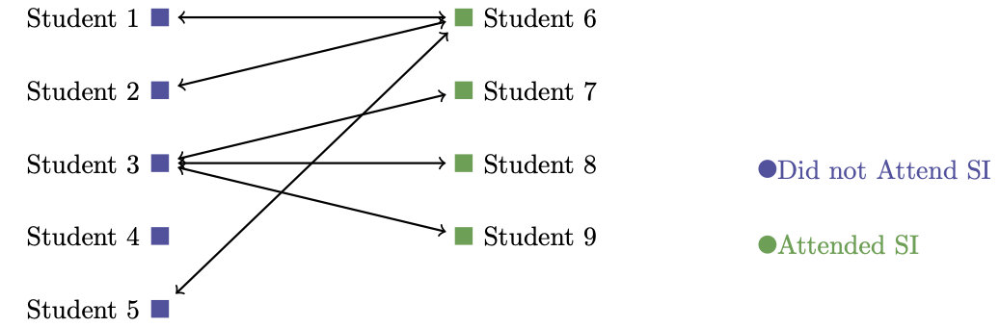
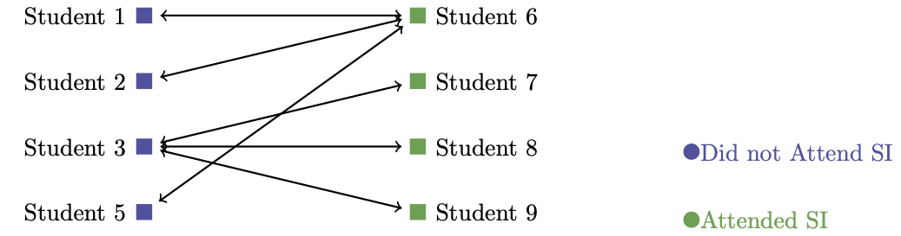
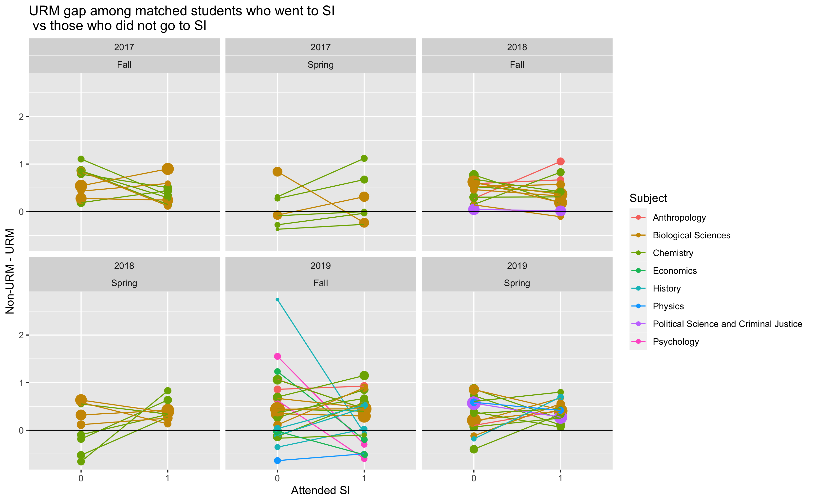
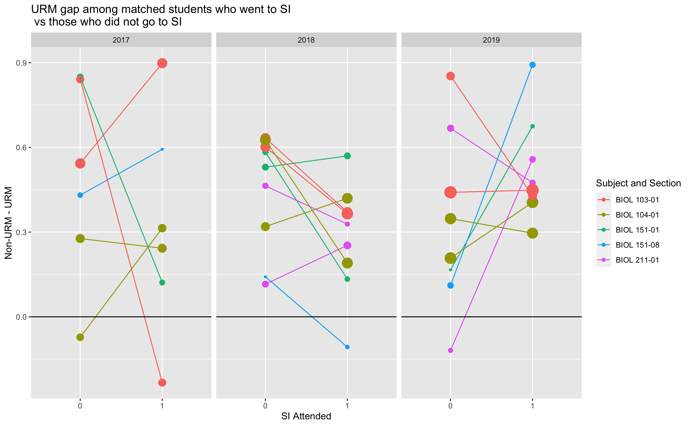

```{r setup, include=FALSE}
knitr::opts_chunk$set(echo = FALSE)
```

## Causal Inference 

- {#id .class width=50% height=50%}
- We want to measure the impact SI has on student performance.
- We need to control for these confounding variables!
- We can accomplish this by matching students with similar characteristics.

## How do we match?

- We can't match exactly!
- We coarsen our covariates (think binning). 
- We can now match exactly on our coarsend data.
- Lastly, throw out any unmatched observations

## Controlling for Confounding with Coarsened Exact Matching


## Controlling for Confounding with Coarsened Exact Matching



## Controlling for Confounding with Coarsened Exact Matching



## Covariates for Matching 

- Notion: Good students go to SI, so the benefit is inflated.
  - High School GPA: Helps address the notion SI is only seems benefical.
  - Student Orientation Flag: 
  - Major Stem Flag 

- Demographics
  - Random Course ID
  - Academic Level
  - First Generation Flag
  
- Equity Gaps
  - URM/NonURM Flag
  - Gender Code

## Visualizing the Equity Gap


## Visualizing the Equity Gap




## Effect of SI in General

- After creating our matching, we fit a linear model to estimate the effect SI has on a students final grade.
- We find, after controlling for our confounding variables, SI improves students final grade by half of a letter grade.
- This doesn't address the question of whether or not SI reduces equity gaps.

## Limitations

- We have no data on student living situations.
- The Oroville dam flooding and Camp fire are not being accounted for.
- We are treating equity gaps separtely. 

## Next Steps

- Meet with an expert in Casual Inference.
- Can we extended Causal Inference Techniques to account for equity gaps?
- Can we put dollar amount on the benefit of SI by extending the results of the Casual Inference analysis.


